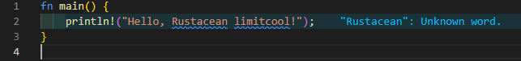
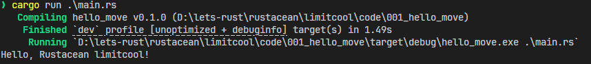

## 基本信息
- Sui钱包地址: `0xcf0c3152905ea004634535e4c84f410b71c58c3d6a691d921e58c5a255cba0a4`
> 首次参与需要完成第一个任务注册好钱包地址才被合并，并且后续学习奖励会打入这个地址,否则视为放弃奖励
- github: `limitcool`

## 个人简介
- 工作经验: 3年
- 技术栈: `Rust` `Go` `Python`
> 重要提示 请认真写自己的简介
- 多年web2及rust开发经验,编写大部分rust开源项目。
- 联系方式: tg: `https://t.me/limitcool`

# 学习笔记
001[安装rust](notes/001_install.md)

## 挑战
-> 文件的路径名不允许中文和空格（部分操作系统不支持）
##   `001`  install
- [X] Cargo CLI version: cargo 1.79.0 (ffa9cf99a 2024-06-03)
- [X] IDE 截图:
- [X] Hello Rust 截图:
