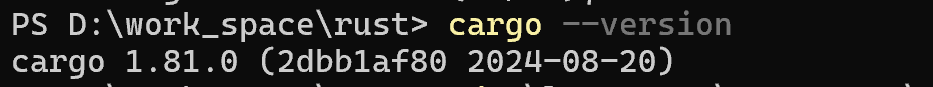
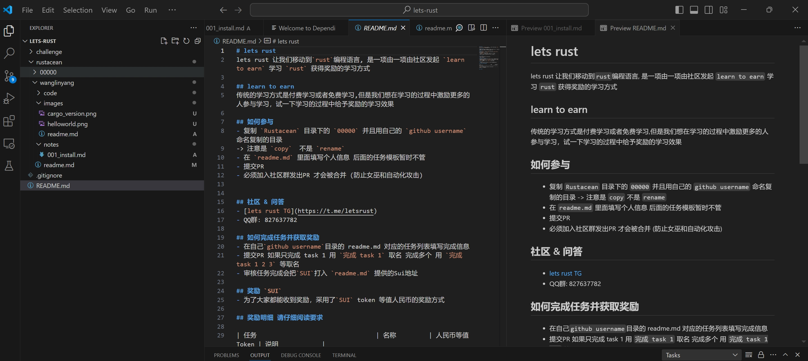
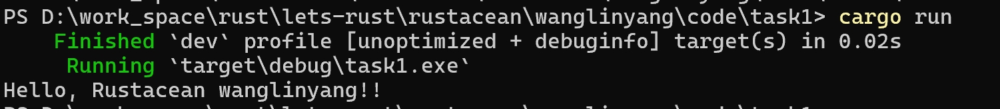

## 基本信息
- Sui钱包地址: `0xd8fb6a5043943dfd49d5247dd534f62fa310df1d1912bae1c529a6e75321eb5b`
- github: [`wanglinyang`](https://github.com/wanglinyang)

## 个人简介
- 工作经验: 8年
- 技术栈: `Java`
- 多年web2开发经验，对`Rust` 特别感兴趣,希望通过学习rust进入web3行业
- 联系方式: tg: `https://t.me/linyangwang` 

# 学习笔记
001[安装rust](notes/001_install.md)

## 挑战
-> 文件的路径名不允许中文和空格（部分操作系统不支持）
##   `001`  install
-  Cargo CLI version:
-  IDE 截图:
-  Hello Rust 截图:
